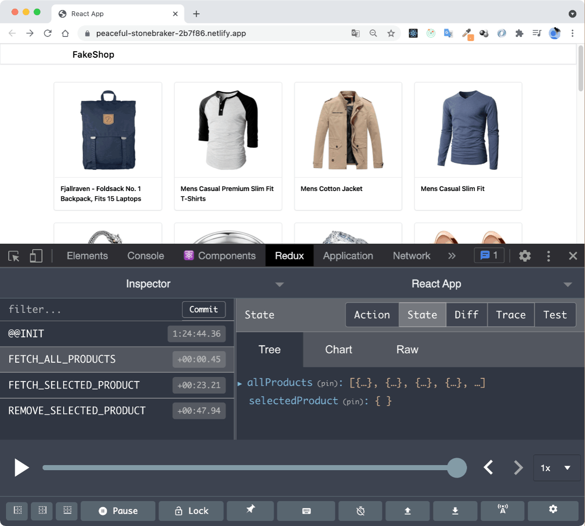
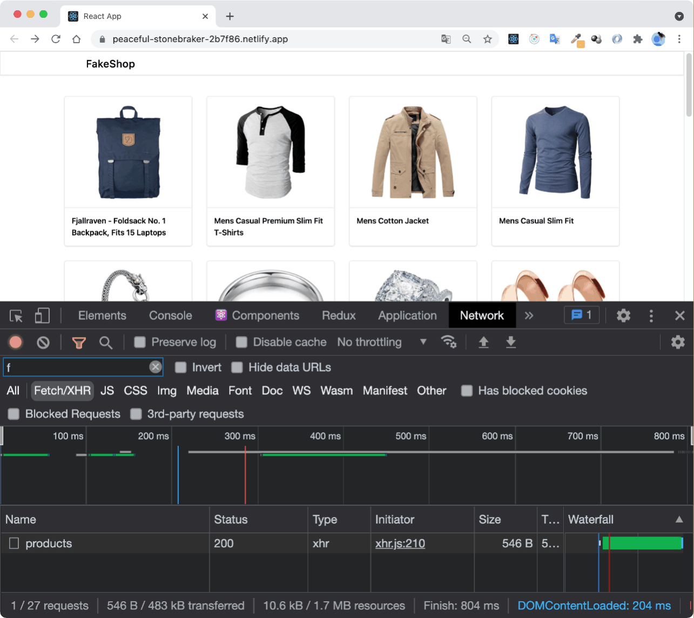

[](https://app.netlify.com/sites/peaceful-stonebraker-2b7f86/deploys)

# This is my work with [Learn React Redux with Project](https://www.youtube.com/watch?v=0W6i5LYKCSI), [Learn React Redux Thunk with Project](https://www.youtube.com/watch?v=JDZRfLGNWdc) and [Deploy React Redux Application to Netlify](https://www.youtube.com/watch?v=GqrKlAKOSoc) by [Dipesh Malvia](https://www.youtube.com/channel/UChPxqdfDbulLE9PyUqhijWw)



## Preview the application live on : [DEMO 🚀](https://peaceful-stonebraker-2b7f86.netlify.app/)

There is [original repository](https://github.com/dmalvia/React_Redux_Tutorial) with code from the tutorial.

## Quick start

1. Clone this repository
2. `npm install` in the project root folder
3. `npm start` to start the project locally

## General info

Tutorials I worked on explained usage redux and redux-thunk in React applications.

## Description

During working with tutorials I've tried to refactor code to be better. Also as always I was trying to change as many things as posible.

## 🎓 Things I learned from tutorial

- 🌱 how to build architecture of [redux](https://redux.js.org/) applications
- 🌱 how to move query to api from component to Action Creator using [redux-thunk](https://github.com/reduxjs/redux-thunk)
- 🌱 how to deploy application automatically using [Netlify](https://www.netlify.com/) (based on changes in github repository)

## 🚧 Things I did myself ‼️

### 🔴 I use [Tailwind CSS](https://tailwindcss.com) instead global styles from index.css and [Semantic UI](https://semantic-ui.com/) as it was shown in the tutorial

I rebuilt styles using [Tailwind CSS](https://tailwindcss.com). I discovered Tailwind recently and I wanted to practise it. I really like it. For mor complicated elements I used [styled-components](https://styled-components.com/). Also I added media queries using Tailwind.

### 🔴 I refactored redux structury

I changed structure of data in store and separated reducers and action creators into others files. Also I changed naming of constants, actions and reducers (now they are more clearly I think).

### 🔴 I created new components and changed structure of components

I build components`<MainLayout></MainLayout>`, `<Card></Card>` and `<Loading />`. Alco I refactoring structure of components using `<ProductsPage />` and `<ProductDetailsPage />`

## ⌨️ Code example

- ### Tailwind CSS
  Tailwind CSS is a modern and increasingly popular framework that is changing the way we work with CSS in our projects. At the beginning you may think this might not be useful but you will change your mind after short work with it. Using Tailwind we can write, read and edit styles faster. The styles the Tailwind provides are beautiful and customizable.

`Example of usage Tailwind in Card.jsx:`

```jsx
export default function Card({ children }) {
  return (
    <div className="w-full px-10 sm:px-0 sm:w-6/12 lg:w-4/12 xl:w-3/12 ">
      <div className="pb-8 sm:mx-4 h-full">
        <div className="shadow border-2 rounded-md h-full transition transform hover:-translate-y-1 ">
          {children}
        </div>
      </div>
    </div>
  );
}
```

`Example of usage Tailwind in Header.jsx:`

```jsx
export default function Header() {
  return (
    <div className="fixed inset-0 w-full z-50 h-14 pt-3 bg-white border shadow">
      <div className="w-full md:w-11/12 md:my-0 md:mx-auto lg:w-9/12">
        <h2 className="text-2xl font-medium">FakeShop</h2>
      </div>
    </div>
  );
}
```

- ### reducer
  In reducer action is destructured so type and payload are available directly. Object ActionTypes is imported to prevent spelling mistakes and duplication of action types.

```jsx
import { ActionTypes } from "../constants/action-types";

export const selectedProductReducer = (state = {}, { type, payload }) => {
  switch (type) {
    case ActionTypes.FETCH_SELECTED_PRODUCT:
      return { ...payload };

    case ActionTypes.REMOVE_SELECTED_PRODUCT:
      return {};

    default:
      return state;
  }
};
```

## 📺 Screenshot GIFs

### Queries to API using axios



### Mediaqueries using Tailwind CSS


